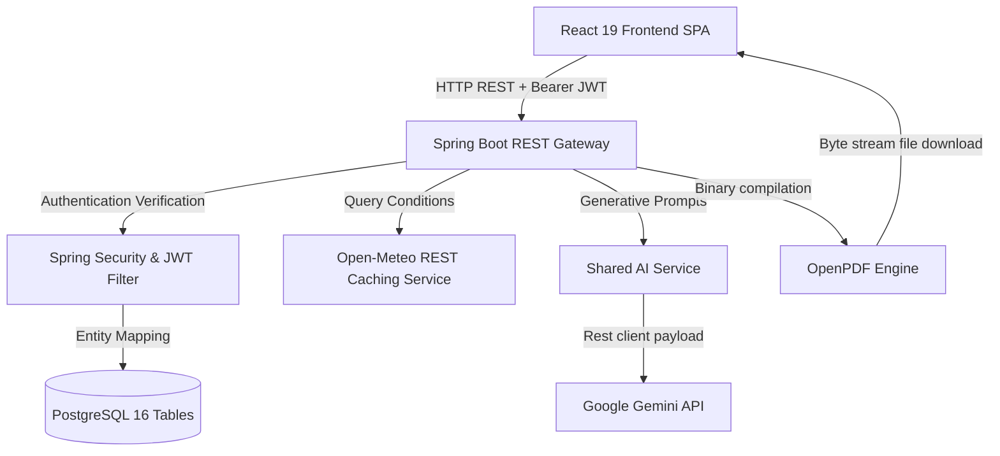

# 🌌 IntelliSphere: Enterprise Decision Intelligence Platform
## 📄 Complete Project Report & Technical Blueprint (Start to End)
* **Date**: August 2026**
* **Status**: Production Deployed
* **Target Environment**: Multi-Tenant Cloud (Render, Vercel, Neon PostgreSQL)

---

## 📖 Executive Summary
IntelliSphere is a cutting-edge Enterprise Decision Intelligence Platform. Modern organization managers and municipal operators suffer from severe operational data silos, causing delayed, reactive decisions that lead to expensive equipment downtime, crop dehydration, hospital queue congestion, and municipal grid failures.

IntelliSphere bridges these operational silos by consolidating real-time telemetry from four target industries—**Agriculture**, **Healthcare**, **Manufacturing**, and **Smart Cities**—into a single glassmorphic command cockpit. Powered by a decoupled Spring Boot backend gateway, a responsive React frontend SPA, and Google Gemini AI, the platform evaluates risk factors, simulates mitigations, generates predictive briefings, and compiles cryptographically signed PDF reports on-the-fly.

---

## ⚠️ Problem Statement
Modern enterprises are overwhelmed by disconnected IoT metrics:
1. **Agricultural Silos**: Soil hydration and nitrogen-phosphorus-potassium (NPK) readings operate isolated from local meteorological forecasts, causing suboptimal irrigation.
2. **Clinical Healthcare Congestion**: Emergency room triage flows work in isolation from municipal incident streams, delaying urgent staffing adjustments.
3. **Unplanned Factory Downtime**: Assembly lines suffer catastrophic machinery valve and spindle failures because operators react only after vibration indexes pass thresholds.
4. **Smart City Vulnerabilities**: Power grid load fluctuations and water main leakage events are monitored separately, leaving city planners without unified spatial tracking.

---

## 💡 The Solution
IntelliSphere offers a unified decision intelligence command shell:
* **Interactive GIS Map Overlay**: Integrates a multi-layer Leaflet map mapping real-time alerts, citizen complaints, and grid operations.
* **Shared AI Service**: Feeds aggregated database telemetry straight into Google Gemini models to extract risk mitigations.
* **On-the-Fly OpenPDF Compilations**: Compiles telemetry charts and predictive logs into secure, downloadable PDF and Excel files.
* **Multi-Role RBAC Management**: Secures workspace access through four isolated, pre-seeded operational roles.

---

## 🏗️ System Flow & Architecture
IntelliSphere is designed as a high-performance monorepo utilizing a decoupled client-server architecture:



### 1. Frontend Layer (`client/`)
* **React 19 & TypeScript**: Single Page Application structure with dynamic route lazy loading.
* **Vite 8.1**: Superfast build bundle pipeline.
* **Zustand**: Lightweight global state management.
* **Tailwind CSS v4 & shadcn/ui**: Modern, responsive styling with smooth transition tokens.
* **Apache ECharts**: Interactive telemetry step-lines, radar grids, and progress gauges.
* **React Leaflet**: GIS spatial mapping.

### 2. Backend Layer (`server/`)
* **Spring Boot 3.3.1 (JDK 21+)**: Secure REST gateway handles REST controllers, service filters, and security context.
* **Spring Data JPA & Hibernate**: Object-Relational Mapping (ORM) targeting PostgreSQL database.
* **Spring Security & JWT**: Stateless Token provider validating user sessions.
* **OpenPDF Engine (v1.3.30)**: Compiled PDF writer.
* **Spring Cache**: Implements thread-safe declarative caches with custom TTLs.

---

## 🗄️ Database Schema & Relational Structure (42 Tables)
The database schema consists of **42 tables** structured logically:

### 1. Platform Core (Tables 1 - 13)
* `roles`: Stores security access roles (`ADMIN`, `OPERATOR`, `USER`) and permissions.
* `users`: Individual workspace operators, passwords (BCrypt hashed), and role links.
* `organizations`: Multi-tenant organization entities.
* `user_sessions`: Audits active JWT sessions and client IP addresses.
* `industry_modules`: Registers active verticals (Agriculture, Healthcare, etc.).
* `assets` / `sensors`: Maps physical machines, farms, or devices to telemetry feeds.
* `reports` / `alerts`: Records historical PDF sheets and smart alarms.
* `predictions` / `recommendations` / `notifications` / `audit_logs`.

### 2. Agriculture Verticals (Tables 14 - 16)
* `farms` / `crops` / `diseases`: Soil readings, NPK levels, and pest risk mappings.

### 3. Healthcare Verticals (Tables 17 - 24)
* `hospitals` / `departments` / `beds` / `patients` / `medical_reports` / `emergency_cases`.

### 4. Manufacturing Verticals (Tables 25 - 33)
* `mfg_factories` / `mfg_production_lines` / `mfg_machines` / `mfg_production_metrics` / `mfg_maintenance_logs` / `mfg_energy_usage` / `mfg_alerts`.

### 5. Smart City Verticals (Tables 34 - 42)
* `sc_cities` / `sc_traffic_zones` / `sc_air_pollution_logs` / `sc_waste_containers` / `sc_power_grids` / `sc_citizen_complaints` / `sc_alerts`.

---

## 🔐 Role-Based Access Control (RBAC) Matrix
IntelliSphere isolates system capabilities dynamically according to user roles:

| Role | Target Persona | Access Level | Primary Scope |
| :--- | :--- | :--- | :--- |
| `SUPER_ADMIN` | Platform Owner | Full Read/Write | System-wide organization onboarding, tenant management, root audit logs, database seed configs. |
| `ORG_ADMIN` | Tenant Manager | Read/Write | API key setups, workspace settings, profile customization, report exports. |
| `ANALYST` | Operations Scientist | Read/Simulate | AI chat prompts, OEE calculations, custom telemetry graphs, running predictions. |
| `OPERATOR` | Control Desk Staff | Read/Acknowledge | Real-time map views, weather dashboard overlays, smart alarm review and dismissals. |

---

## 🏁 Quick Start & Installation Guide

### Prerequisites
* **Node.js** (v18.0.0+)
* **Java Development Kit (JDK 21)**
* **Docker & Docker Compose**

### Step 1: Clone and Infrastructure Startup
Spin up the local PostgreSQL database and Redis services:
```bash
git clone https://github.com/VIJAYAPANDIANT/intellisphere.git
cd intellisphere
docker compose up -d postgres redis
```

### Step 2: Database Schema Seeding
Apply the SQL schema manually to your PostgreSQL database instance:
```bash
psql -h localhost -U admin -d intellisphere -f database/schema.sql
```

### Step 3: Run the Backend (Spring Boot)
1. Copy `server/.env.example` to `server/.env` and adjust your details.
2. Run the server using Maven:
   ```bash
   cd server
   $env:JAVA_HOME = "C:\Program Files\Java\jdk-26.0.1" # PowerShell adjust path
   ./mvnw spring-boot:run
   ```
On startup, the `DatabaseSeeder.java` will automatically verify the database state. If the database is blank, it seeds 42 tables of telemetry data and 4 demo accounts.

### Step 4: Run the Frontend (React Vite)
1. Copy `client/.env.example` to `client/.env` and update `VITE_API_URL`.
2. Run the client:
   ```bash
   cd client
   npm install --legacy-peer-deps
   npm run dev
   ```
Open `http://localhost:5173` to explore the workspace cockpit.

---

## 🔑 Seeded Demo Credentials
Use any of the following pre-seeded credentials to explore the dashboard roles:

* **Super Admin**: `superadmin@intellisphere.com` / `superadminpassword`
* **Organization Admin**: `admin@intellisphere.com` / `adminpassword`
* **Analyst**: `analyst@intellisphere.com` / `analystpassword`
* **Operator**: `operator@intellisphere.com` / `operatorpassword`

---

## 🔮 Future Roadmap
* **Real-time WebSockets Integration**: Push sensor alarms (vibrations, pressure) instantly from machines to the UI.
* **AI Model Fine-tuning**: Support locally hosted Ollama/Llama-3 models inside private cloud environments for HIPAA-compliant hospital deployments.
* **Advanced Drillings**: Enable deeper Analytical Drilling into historic Smart City metrics.
