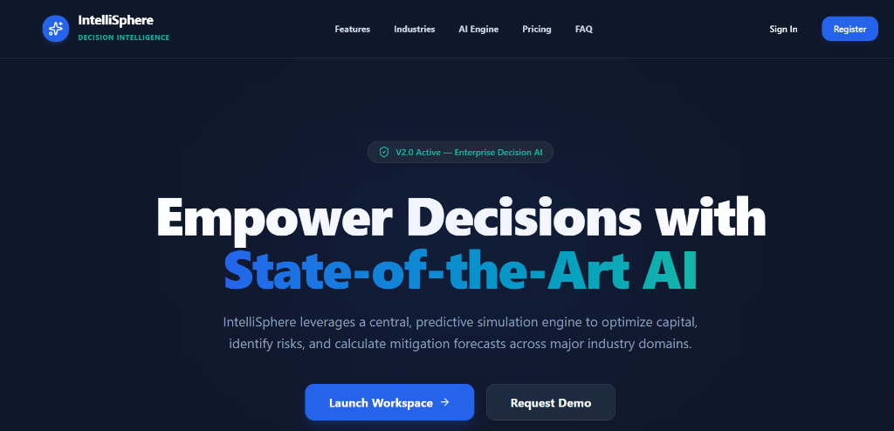
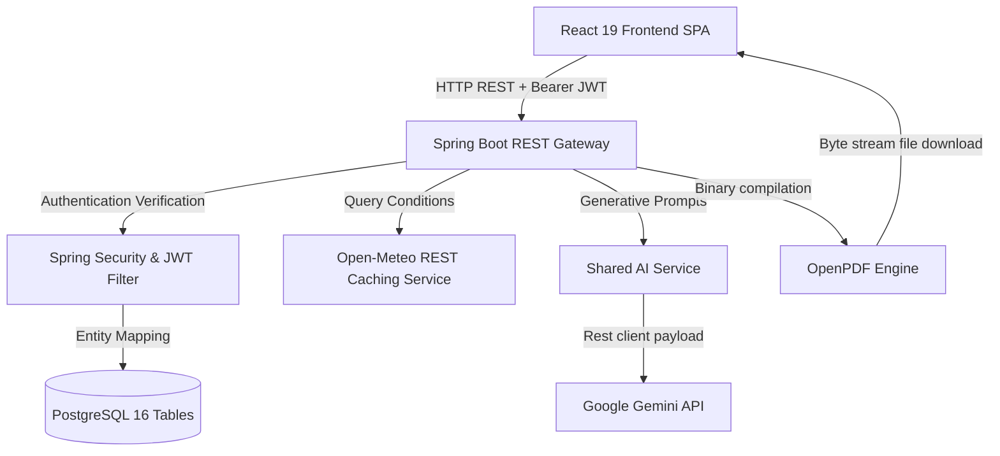

# 🌌 IntelliSphere

<div align="center">
  
  
  
  
  
  
  

  <p align="center">
    <strong>AI-Powered Cross-Industry Decision Intelligence Platform</strong>
    <br />
    Optimize resource flows, forecast municipal risks, and generate predictive analytics briefs using Gemini AI models.
  </p>

  <br />
  
  <br />
</div>

---

> [!NOTE]
> **Production Ready Platform**: IntelliSphere compiles cleanly using JDK 21+ and Vite, supporting local docker compose orchestrations and cloud hosting deployments (Supabase, Koyeb, and Vercel).

---

## 📖 Table of Contents
1. [Project Overview](#-project-overview)
2. [Problem Statement](#-problem-statement)
3. [Solution](#-solution)
4. [Monorepo Architecture](#-monorepo-architecture)
5. [System Flow Architecture](#-system-flow-architecture)
6. [Tech Stack & Dependencies](#-tech-stack--dependencies)
7. [Database Schema (42 Tables)](#-database-schema-42-tables)
8. [Core Features](#-core-features)
9. [REST APIs Reference](#-rest-apis-reference)
10. [Quick Start & Installation](#-quick-start--installation)
11. [Running Test Suites](#-running-test-suites)
12. [Production Deployment & Dockerization](#-production-deployment--dockerization)
13. [Future Scope](#-future-scope)
14. [License](#-license)
15. [Contributors](#-contributors)

---

## 🌌 Project Overview
IntelliSphere is a cutting-edge Enterprise Decision Intelligence Platform. Designed for solutions architects and municipal operators, it consolidates telemetry from **Agriculture**, **Healthcare**, **Manufacturing**, and **Smart Cities** into a central dashboard. Driven by a secure Spring Boot gateway and an interactive Gemini AI engine, it simulates risk vectors, lists optimization suggestions, and compiles corporate PDF reports.

## ⚠️ Problem Statement
Modern enterprise managers suffer from **operational silos**:
- Soil sensor readings are isolated from weather services.
- Clinic patient flows operate independently of municipal accident databases.
- Factory machines suffer unexpected valve failures due to uncoordinated telemetry.
- Decision makers lack a single, predictive window to evaluate simulations and risks.

## 💡 Solution
IntelliSphere bridges these gaps with a unified full-stack monorepo:
1. **Unified AI Command Center (WOW Feature)**: Operates a cross-industry cockpit displaying a Global Risk Index score, ambient circular gauges, and interactive timelines.
2. **Predictive Diagnostic Models**: Automatically flags critical alerts (e.g. river flooding warnings, load shedding, machine joint stress) and suggests corrective actions.
3. **Automated PDF Generator**: Queries Gemini AI using custom prompts, compiles analysis into OpenPDF sheets, and provides downloadable files.
4. **Interactive GIS Overlays**: Integrates dynamic Leaflet markers wrapping Lucide icons for immediate spatial coordinates tracking.

---

## 🏗️ Monorepo Architecture
```
intellisphere/
├── client/          # React Frontend (Vite, TypeScript, Tailwind CSS, shadcn/ui)
├── server/          # Spring Boot Backend (Java 21, Maven)
├── docs/            # Platform & Architecture Documentation
├── assets/          # Brand Assets, Logos, and Media
├── database/        # SQL Schemas, Migrations & Database Seeds
├── api/             # API Documentation & Postman Collections
├── docker/          # Dockerfiles & Multi-stage Build Configs
└── docker-compose.yml
```

---

## 🏗️ System Flow Architecture
The diagram below maps data flow from Client SPA actions to the PostgreSQL database, Gemini API, and Open-Meteo REST caches:



---

## 🛠️ Tech Stack & Dependencies

### Frontend (`client/`)
- **Framework**: React 19, TypeScript, React Router Dom
- **Build Core**: Vite 8.1 (configured with dynamic route lazy loading)
- **State Management**: Zustand
- **Form Libraries**: React Hook Form, Zod validation
- **Data Visuals**: Apache ECharts (`echarts-for-react`)
- **GIS Mapping**: React Leaflet, OpenStreetMap TileLayers
- **Styling Presets**: Tailwind CSS v4, shadcn/ui, Lucide Icons

### Backend (`server/`)
- **Framework**: Spring Boot 3.3.1 (Java 21)
- **Build System**: Maven (via `./mvnw` wrapper)
- **Database Access**: Spring Data JPA / Hibernate
- **Caching**: Spring Boot `@EnableCaching` & `@Cacheable`
- **Security**: Spring Security & stateless JWT Token Providers
- **Export Engines**: OpenPDF (v1.3.30)
- **REST Docs**: SpringDoc OpenAPI Swagger UI

---

## 📄 Database Schema (42 Tables)
The platform schema manages relational tables mapping:
- **Core (1–13)**: `roles`, `users`, `organizations`, `user_sessions`, `industry_modules`, `assets`, `sensors`, `reports`, `alerts`, `predictions`, `recommendations`, `notifications`, `audit_logs`.
- **Agriculture (14–16)**: `farms`, `crops`, `diseases`.
- **Healthcare (17–24)**: `hospitals`, `departments`, `patients`, `beds`, `medical_reports`, `healthcare_alerts`, `healthcare_recommendations`, `emergency_cases`.
- **Manufacturing (25–33)**: `mfg_factories`, `mfg_production_lines`, `mfg_machines`, `mfg_production_metrics`, `mfg_maintenance_logs`, `mfg_energy_usage`, `mfg_alerts`, `mfg_predictions`, `mfg_recommendations`.
- **Smart City (34–42)**: `sc_cities`, `sc_traffic_zones`, `sc_air_pollution_logs`, `sc_waste_containers`, `sc_water_stations`, `sc_power_grids`, `sc_citizen_complaints`, `sc_infrastructure_assets`, `sc_alerts`, `sc_recommendations`.

---

## ⚙️ Core Features

### 1. Flagship AI Command Center (`/ai-center`)
- Displays double progress indices: **Global Risk (24.5%)** and **Sustainability (88.2%)**.
- Compiles linear typewriter briefings from cross-industry inputs (soil, OEE, grid, ICU).
- Interactive Action Items checklist allowing operators to click to cycle item status lifecycles.
- Direct Axios conversation link to `/api/ai/chat`.

### 2. Sustainability & ESG Dashboard (`/sustainability`)
- Monitors carbon emissions, solar/wind renewable mixes, and water conservation step lines.
- Integrates progress recycling gauges and green Boulevard canopy coverage indicators.

### 3. Smart City Module (`/smart-city`)
- Dynamic 7-layer Leaflet OSM map highlighting active incidents, complaints, and AQI bounds.
- Live traffic rerouting models and grid load-shedding overrides optimization simulators.

### 4. Precision Agriculture & Healthcare Modules
- NPK soil health status tables and autonomous tractor sensors registers.
- ER clinic triage queue models and admitted patient chart listings.

---

## 🌐 REST APIs Reference

| Endpoint | Method | Purpose | Authentication |
| :--- | :--- | :--- | :--- |
| `/api/v1/auth/login` | `POST` | Authenticate credentials and return JWT bearer token | Public |
| `/api/v1/dashboard/overview` | `GET` | Retrieve overall telemetry statistics | JWT Required |
| `/api/v1/industry/healthcare/simulate` | `POST` | Execute hospital load and staffing simulations | JWT Required |
| `/api/smartcity/dashboard` | `GET` | Retrieve active city municipal statuses | JWT Required |
| `/api/smartcity/report` | `POST` | Compile and stream OpenPDF report byte files | JWT Required |
| `/api/ai/chat` | `POST` | Query Gemini conversational prompts | JWT Required |

---

## 🏁 Quick Start & Installation

### Prerequisites
- **Node.js** (v18.0.0 or higher)
- **Java SE Development Kit** (JDK 21 or higher)
- **Docker & Docker Compose**

### 1. Infrastructure Startup
Spin up the PostgreSQL and Redis containers locally:
```bash
docker compose up -d postgres redis
```

### 2. Backend Startup
Set Java 21 environment parameters, navigate to the folder, and run:
```bash
cd server
$env:JAVA_HOME = "C:\Program Files\Java\jdk-26.0.1" # Adjust path for your system
./mvnw spring-boot:run
```
*The database seeder automatically populates all 42 tables if the database is blank on startup.*

### 3. Frontend Startup
Navigate to the client folder, install modules, and start the development server:
```bash
cd client
npm install --legacy-peer-deps
npm run dev
```
Open `http://localhost:5173` to explore the workspace cockpit.

### 🔑 Seeded Demo Credentials
Use any of the following pre-seeded credentials to explore the dashboard roles:

| Role | Email Address | Password |
| :--- | :--- | :--- |
| **Super Admin** | `superadmin@intellisphere.com` | `superadminpassword` |
| **Organization Admin** | `admin@intellisphere.com` | `adminpassword` |
| **Analyst** | `analyst@intellisphere.com` | `analystpassword` |
| **Operator** | `operator@intellisphere.com` | `operatorpassword` |

---

## 🧪 Running Test Suites

### 1. Frontend SPA Tests (Vitest & jsdom)
```bash
cd client
npm run test
```

### 2. Backend Integration Tests (JUnit & MockMvc)
```bash
cd server
./mvnw test
```

---

## 🚀 Production Deployment & Dockerization

For cloud hosting details (Vercel, Koyeb, Supabase database, and Cloudinary storage):
- **Deployment Manual**: [Production Deployment Guide](file:///c:/Intellisphere/docs/deployment_guide.md)
- **Docker Compose**: Build and run all full-stack services concurrently:
  ```bash
  docker compose up --build
  ```

---

## 🔮 Future Scope
- **Real-time WebSockets**: Push instant IoT sensor alerts from factories directly to the UI overlay.
- **Dynamic Chart Drilling**: Enable deep interactive analytical drilling into historical city records.
- **Role-based Permission Guarding**: Wire strict access control limitations between Operators and Admins.

---

## 📄 License
This project is licensed under the MIT License - see the LICENSE file for details.
