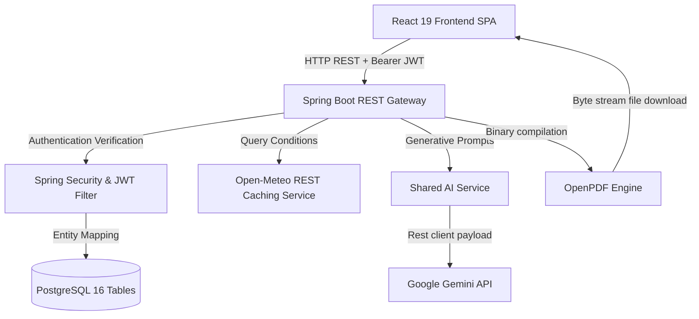

# 🌌 IntelliSphere

> **AI-Powered Decision Intelligence Platform**

IntelliSphere is a state-of-the-art Decision Intelligence Platform designed to help enterprise leaders make complex, data-driven decisions through advanced AI analytics, simulations, and predictive modeling.

---

> [!NOTE]
> **Day 6 Milestone Achieved**: The **Smart City Module**, **Interactive GIS Map**, **Sustainability & ESG Command Dashboard**, and **Flagship AI Smart City Command Center** have been successfully added to the platform. Operators can now toggle custom map layers, run emergency disaster risk scenarios, analyze carbon footprints, and download compiled executive briefs.

---

## 🏗️ Monorepo Architecture

IntelliSphere is organized as a unified monorepo for seamless integration, testing, and deployment:

```
intellisphere/
├── client/          # React Frontend (Vite, TypeScript, Tailwind CSS, shadcn/ui)
├── server/          # Spring Boot Backend (Java 21, Maven)
├── docs/            # Platform & Architecture Documentation
├── assets/          # Brand Assets, Logos, and Media
├── database/        # SQL Schemas, Migrations & Database Seeds
├── api/             # API Documentation & Postman Collections
├── docker/          # Dockerfiles & Multi-stage Build Configs
└── docker-compose.yml
```

## 🏗️ System Architecture

IntelliSphere follows a secure, decoupled full-stack architectural paradigm. The data flow from UI interactions to external service overlays is modeled below:



---

## 🛠️ Tech Stack & Technologies

### Frontend (`client/`)
- **Core**: React 19, TypeScript, React Router
- **Build Tool**: Vite
- **State Management**: Zustand
- **Form Libraries**: React Hook Form, Zod validation
- **Query & Fetching**: TanStack Query, Axios (configured with bearer token headers)
- **Styling**: Tailwind CSS v4, shadcn/ui (Radix UI core & Nova preset)
- **Data Visualization**: Apache ECharts (`echarts-for-react`)
- **GIS Mapping**: Leaflet Map Integration with OpenStreetMap standard tiles and custom badged divIcons

### Backend (`server/`)
- **Framework**: Spring Boot 3.3.1 (Java 21)
- **Build System**: Maven (via `./mvnw` wrapper, Lombok version 1.18.46)
- **Database Access**: Spring Data JPA / Hibernate
- **Security**: Spring Security & JWT (using `jjwt` 0.12.5) with stateless filters
- **AI Engine**: Google Gemini API integration (`v1beta/models/gemini-1.5-flash`)
- **Document Export**: PDF generation using `openpdf` (v1.3.30)
- **REST Documentation**: SpringDoc OpenAPI Swagger UI

### Database & DevOps
- **Relational DB**: PostgreSQL 15+ (comprehensive 42-table schema)
- **Caching & Messaging**: Redis 7+
- **Containerization**: Docker & Docker Compose
- **CI/CD**: GitHub Actions workflows validating client packages (legacy peer dependency bypasses) and Maven compilation under JDK 21.

---

## 📄 Database Architecture (`database/`)

The PostgreSQL relational database is structured around 42 core tables:
1. **`roles`**: User authorization levels (`SUPER_ADMIN`, `ORG_ADMIN`, `ANALYST`, `OPERATOR`) and permissions arrays.
2. **`users`**: Identity credentials and role mappings with BCrypt hashing.
3. **`organizations`**: Workspace management and tenant groupings.
4. **`user_sessions`**: Session tokens logging, IP addresses, client agents, and expiration.
5. **`industry_modules`**: Registrations for domain-expert AI setups.
6. **`assets`**: Client hardware assets (Tractors, Turbines, CT Scanners, etc.).
7. **`sensors`**: IoT sensor registrations, units, and readings.
8. **`reports`**: Log trackers for documents and sheet uploads.
9. **`alerts`**: System alarm states and severities.
10. **`predictions`**: Simulation parameters and outcomes produced by the AI engine.
11. **`recommendations`**: Prioritized recommendations derived from AI models.
12. **`notifications`**: Active notifications for users.
13. **`audit_logs`**: Audit trail of system actions and network IPs.
14. **`farms`**: Tracks location, organization ties, and acreage.
15. **`crops`**: Logs growth stages, active health index ratios, and target farm references.
16. **`diseases`**: Logs localized disease names, probability risks, and mitigation advice.
17. **`hospitals`**: Tracks healthcare institutions.
18. **`departments`**: Clinical departments (ER, ICU).
19. **`patients`**: Patient diagnostic history logs.
20. **`beds`**: Room bed statuses.
21. **`medical_reports`**: Direct digital patient consult charts.
22. **`healthcare_alerts`**: Alarm triggers for clinical environments.
23. **`healthcare_recommendations`**: AI clinical recommendations.
24. **`mfg_factories`**: Plant names, OEE percentages, active machines, and daily target metrics.
25. **`mfg_production_lines`**: Assembly line targets, outputs, and OEE performance trackers.
26. **`mfg_machines`**: Telemetry sensor boundaries (temp, vibration, spindle speed, hydraulic PSI, age).
27. **`mfg_production_metrics`**: Target vs completed units, scrap log values, and yield rates.
28. **`mfg_maintenance_logs`**: Work orders schedule logs, severities, and assigned technicians.
29. **`mfg_energy_usage`**: Energy consumption levels, peak loads, and cost tracking logs.
30. **`mfg_alerts`**: Alarm categories (Machine Failure, Safety curtains, temperature spikes) and statuses.
31. **`mfg_predictions`**: Equipment failure probabilities, confidence parameters, and diagnostics.
32. **`mfg_recommendations`**: Preventative repair guidance cards and estimated financial savings.
33. **`sc_cities`**: Tracks metropolitan coordinates and population details.
34. **`sc_traffic_zones`**: Congestion index, speeds, and status limits.
35. **`sc_air_pollution_logs`**: Air Quality Index (AQI) logs, PM2.5, and PM10 parameters.
36. **`sc_waste_containers`**: Bin capacity readings and fill percentage sensors.
37. **`sc_water_stations`**: flow rates, pump pressures, and purity percentages.
38. **`sc_power_grids`**: Operating capacities and current grid loads.
39. **`sc_citizen_complaints`**: Logs complaints categorized by category with reporter info.
40. **`sc_infrastructure_assets`**: Bridges and subways status checks and structural health scores.
41. **`sc_alerts`**: Flashing alarms for active incidents and warnings.
42. **`sc_recommendations`**: AI recommendations with estimated financial savings and emission reductions.

---

## 🤖 AI Engine & Report Generator

The platform implements a unified, central AI engine service (`AIService.java` & `GeminiService.java`) that drives core decision capabilities across all industry modules:
- **Google Gemini API**: Processes parameter DTOs, evaluates risk indexes, and generates suggestions via the official Gemini endpoint (`gemini-1.5-flash`). Supports realistic fallback mocks for local testing.
- **On-the-fly PDF Generation**: Integrates OpenPDF (`com.lowagie.text`) to compile metrics, alarm feeds, and operator notes into styled corporate PDF sheets on the fly.
- **AI Chat Assistant**: Interactive conversation playground using context-aware prompts.
- **Live Weather Cache**: Queries Open-Meteo REST parameters for farm coords and caches results in a thread-safe synchronized ConcurrentHashMap with a 15-minute TTL.

---

## 📂 Core UI Pages Layout

The frontend SPA maps the following user paths:
- `/` - Public marketing landing page.
- `/login` / `/register` - Secure authentication gateways.
- `/dashboard` - Operational cockpit containing animated KPI cards, live weather overlay widget, smart alerts list, and recent predictions list.
- `/agriculture` - Agriculture cockpit containing overview metrics, NPK soil health cards, crop monitoring table, field map, diagnostics scanner, and report generators.
- `/healthcare` - Healthcare cockpit containing triage simulator, admitted patient rosters, admissions charts, and AI clinical report briefs.
- `/manufacturing` - Manufacturing cockpit containing machine monitoring center, filterable assembly lines, and predictive maintenance anomaly risk models.
- `/smart-city` - Smart City operations center containing:
  - **Live Dashboard**: KPI cards, Leaflet map overlays with 7 togglable layers, and active alarms resolving center.
  - **Sensors Registry**: IoT registers tracking waste fills, water station flows, and infrastructure health score cards.
  - **Citizen Hub**: Public forum submitting municipal complaints directly to backend.
  - **AI Optimizer**: Parametric evaluation running detour and power load models.
  - **AI Command Center (WOW)**: Flagship simulation dashboard with flood heights sliders, neural rotating scanners, double gauges (City Health 92% and Sustainability 88%), and vertical deterioration timelines.
- `/sustainability` - Standalone sustainability dashboard displaying carbon emissions trends, solar/wind renewable mixes, water conservation step lines, waste gauges, green canopy coverage meters, and AI ESG recommendations.
- `/uploads` - Drag-and-drop Upload Center.
- `/analytics` - Analytics dashboard toggling agriculture, manufacturing, and smart city charts (8 ECharts: Traffic, Pollution, Water flow, Grid loads, Complaint shares, Incident alarms, Waste, and City Performance radar indices).
- `/notifications` - Alert Center toggling between System Log notifications, Mfg Smart Alerts, and Smart City Alerts.
- `/ai-center` / `/reports` / `/settings` - Standard operational panels.

---

## 🌐 Conceptual REST APIs

To support the UI layout, the backend controllers expose the following endpoint structures:
- `GET /api/agriculture/dashboard` - Fetches overall crop stats, soil matrices, and Alerts.
- `GET /api/agriculture/weather` - Fetches live weather conditions from Open-Meteo.
- `POST /api/ai/chat` - Submits prompts to the Gemini conversation engine.
- `POST /api/ai/report` - Requests a compiled PDF report document binary.
- `GET /api/healthcare/dashboard` - Fetches clinical KPIs, bed structures, alerts.
- `POST /api/healthcare/report` - Generates healthcare PDF briefs.
- `GET /api/manufacturing/dashboard` - Fetches overall factory KPIs, OEE indices, alerts.
- `POST /api/manufacturing/report` - Compiles and downloads styled Industrial Production briefs.
- `GET /api/smartcity/dashboard` - Fetches city KPIs, grids load, air indices, and alerts.
- `GET /api/smartcity/traffic` - Fetches active congestion zone tables.
- `GET /api/smartcity/pollution` - Fetches particulate levels.
- `GET /api/smartcity/waste` - Fetches trash capacities data.
- `GET /api/smartcity/complaints` - Fetches active citizen complaints register.
- `GET /api/smartcity/analytics` - Fetches overall performance indices.
- `POST /api/smartcity/complaints` - Submits citizen service ticket logs.
- `POST /api/smartcity/report` - Generates smart city PDF executive briefs.
- `POST /api/ai/smartcity-summary` - Direct city brief summaries.
- `POST /api/ai/smartcity/optimize-traffic` - Reroutes traffic detours.
- `POST /api/ai/smartcity/optimize-grid` - Sheds grid power overload.
- `POST /api/ai/smartcity/emergency-risk` - Neural emergency disaster simulations.

---

## 🏁 Quick Start Guide

### Prerequisites
Before running the platform, ensure you have the following installed:
- **Node.js** (v18.0.0 or higher)
- **Java SE Development Kit** (JDK 21 or higher)
- **Docker & Docker Compose**

### 1. Database & Infrastructure Setup
Spin up the required database and cache containers:
```bash
docker-compose up -d
```

### 2. Backend Setup
Navigate to the backend directory, set JDK 21, and compile/start:
```bash
cd server
$env:JAVA_HOME = "C:\Program Files\Java\jdk-26.0.1"
./mvnw spring-boot:run
```

### 3. Frontend Setup
Navigate to the frontend directory, install dependencies, and start the development server:
```bash
cd client
npm install --legacy-peer-deps
npm run dev
```
Open `http://localhost:5173` to explore the platform.

### 4. Running Test Suites
To run the automated backend test suites (which execute against H2 in-memory databases and exclude external API dependencies):
```bash
cd server
./mvnw test
```
