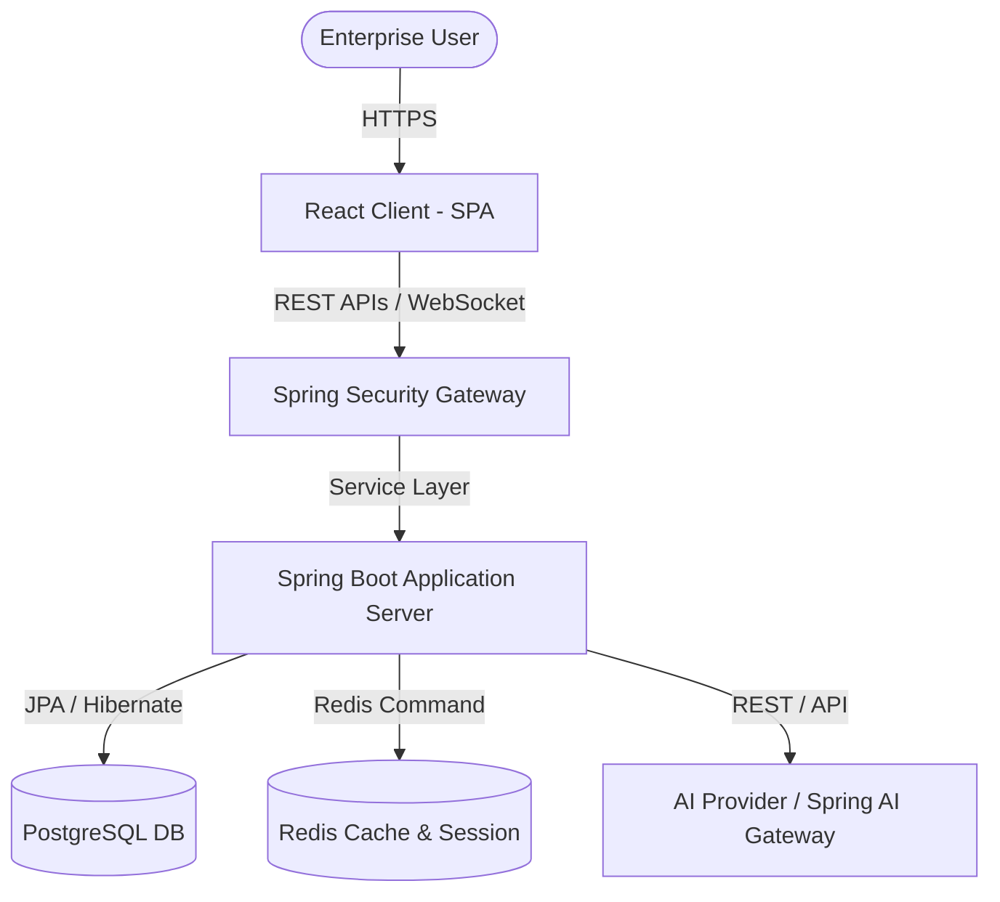

# IntelliSphere Architecture Guide

This document describes the high-level system architecture of IntelliSphere, an AI-Powered Decision Intelligence Platform.

## System Overview

IntelliSphere leverages a modern client-server architecture with modular containerized components:

## Module Responsibilities

### 1. Client (`client/`)
- Single Page Application (SPA) powered by **React** and **Vite**.
- Custom styling system built with Vanilla CSS for maximum efficiency and aesthetic control.
- Responsibilities:
  - User authentication and workspace dashboard.
  - Interactive decision trees, simulations, and charts (built with Recharts).
  - WebSockets for receiving real-time AI modeling and simulation progress.

### 2. Server (`server/`)
- Multi-layered monolithic/modular structure using **Spring Boot 3**.
- Layered Architecture:
  - **Controller / REST Layer**: Exposes secure API endpoints.
  - **Security Layer**: Handles authentication via JWT and roles using Spring Security.
  - **Service Layer**: Implements decision optimization models, simulations, and connects to AI gateways.
  - **Data Access Layer**: JPA repositories interacting with the database.

### 3. Database Schema (`database/`)
- Relational schema optimized for tracking:
  - Decision logs, options, and outcomes.
  - Users, roles, and workspaces.
  - AI model inputs, outputs, and performance metrics.

---

## Technical Design Decisions

| Component | Technology | Rationale |
| :--- | :--- | :--- |
| **Frontend Framework** | React + TypeScript | Dynamic UI rendering with strict type safety. |
| **Build Tooling** | Vite | Faster hot module replacement and bundle size optimization. |
| **Backend Core** | Spring Boot (Java) | Robustness, dependency injection, mature JPA ecosystem, and Spring Security. |
| **Database** | PostgreSQL | ACID compliance, JSONB support for unstructured AI inputs/outputs. |
| **Caching** | Redis | High throughput key-value store for session caching and transient simulation logs. |
